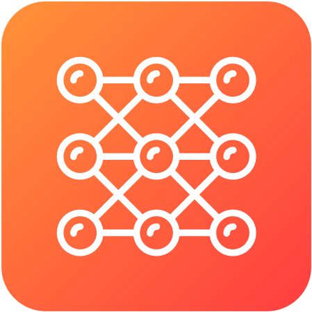

    

<h3 align="center">Algorithms</h3>

  My implementation of algorithms and data structures in different programming languages.
   
   

> The links listed below point to the python code. If you search above ou can also find different language implementations of the algorithms and data structures in the file tree.

## Data Structures

- [Queue](./python/data-structures/queue.py)  
- [Stack](./python/data-structures/stack.py)
- [Linked List](./python/data-structures/linked-list.py)
- [Doubly Linked List](./python/data-structures/doubly-linked-list.py)

 

## Algorithms

- **Math**
  - [Factorial](./python/math/factorial.py)
  - [Fibonacci Number](./python/math/fibonacci.py)
  - [Primality Test](./python/math/prime.py)
  - [Euclidean Algorithm](./python/math/gcd.py)
  - [Least Common Multiple (LCM)](./python/math/lcm.py)
- **Sets**
  - ...
- **Strings**
  - [Hamming Distance](./python/strings/hamming_distance.py)
- **Searches**
  - [Linear Search](./python/search/linear_search.py)
- **Sorting**
  - [Bubble Sort](./python/sort/bubble_sort.py)
  - [Selection Sort](./python/sort/selection_sort.py)
- **Linked Lists**
  - ...
- **Trees**
  - ...
- **Graphs**
  - ...
- **Cryptography**
  - ...
- **Uncategorized**
  - ...
